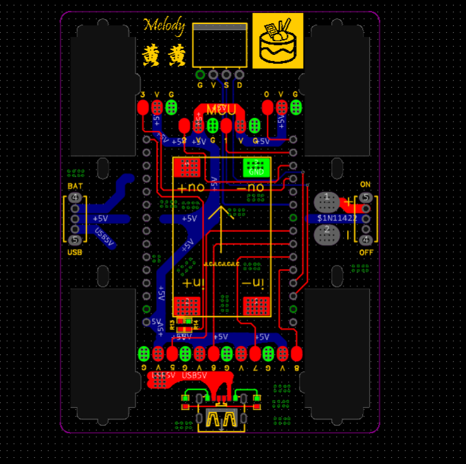

---
tags:
- DIY
- 机器人
- esp8266  
- wifi服务器 
title: DIY四足机器人
date: 2024-09-14
updated: 
categories:
- 记录 
keywords:
- 机器人    
description: 
top_img: 
comments: 
cover: root.png
toc: 
toc_number: 
toc_style_simple: 
copyright: 
copyright_author: 
copyright_author_href: 
copyright_url: 
copyright_info: 
mathjax: 
katex: 
aplayer: 
highlight_shrink: 
aside: 
swiper_index: 1
top_group_index: 1
background: "#fff"
---

# 四足机器人软硬件架构
- 🤦‍♀️飞书画的感觉不咋地

# 四足机器人硬件（所有连接仅供参考，任何问题与本人无关）
## 电池

- 🐱‍👓请一定用万用表检测一下正负极是否和pcb接口对应以及电压是否正常，理论上来说2s~4s锂电池都可以接入

【淘宝】<http://e.tb.cn/h.gKCOp83eZ0tq1GN?tk=drWN3hhtbwJ> HU9196 「电动玩具枪锂电池7.4V充电器四驱越野遥控车充电电池挖掘机软弹枪」
点击链接直接打开 或者 淘宝搜索直接打开


<div align=center >


</div>

**需要购买一套电池**

## 降压模块
- 👀保证至少可以过3A电流。

【淘宝】限时满20减2 <http://e.tb.cn/h.gKaxrAQtpJIKUid?tk=qcLp3hhDj74> MF7997 「MP1584EN 3A 5A可调降压电源模块板稳压航模24V-12V 9V转5VDC-DC」
点击链接直接打开 或者 淘宝搜索直接打开

<div align=center>


</div>

**需要购买1块降压模块**

## NodeMcu 8266开发板
- 🤷‍♀️这个神板因该人手一个，不过现在乐鑫已经推出**esp32c3**了，新神板来了
【淘宝】限时官方立减0.73元 <http://e.tb.cn/h.gKQFJ88xUs7VLfy?tk=jwn13hGPIay> HU0854 「ESP8266串口WIFI模块 CP2102/CH340 NodeMCU Lua V3物联网开发板」
点击链接直接打开 或者 淘宝搜索直接打开
<div align=center>


</div>

**需要购买1块开发板，esp8266 的硬件资源介绍及使用教程请自行学习**


## SG90舵机

- 🐱‍🐉那家便宜买那家，基本都大差不差呀。
【淘宝】限时满88减2 <http://e.tb.cn/h.gq7QGmTuJ59kCKV?tk=Wd5P3hGJuMC> HU9196 「伺服舵机 SG90 MG90S 9g舵机 450直升飞机小车伺服器 180度 360度」
点击链接直接打开 或者 淘宝搜索直接打开
<div align=center>


</div>

**需要购买8个舵机**

## 0.96 OLED

- 🐱这个也是人均有吧。
【淘宝】限时满88减2 http://e.tb.cn/h.gK4KNkc34hgFGe9?tk=9eZ13hGGVYG MF7997 「0.91/0.96/1.3寸白/黄/蓝色 双色 IIC通信小OLED显示屏模块液晶屏」
点击链接直接打开 或者 淘宝搜索直接打开
<div align=center>


</div>

**需要购买1块屏**


## 结构件

- 💕3d建模当年也是我的最爱额。
Solidworks 建模装配体图 组装后和效果和模型差不多，不过组装后我只使用了一块pcb。
 
3D打印使用的是导出stl格式文件，只需要打印四个关节和四个手部，底盘可以直接使用pcb，然后螺丝可以使用sg90舵机自带的。可以购买m2x10的螺柱螺母或者热熔胶来固定pcb和舵机，推荐使用热熔胶，因为热熔胶还可以用来加强oled以及舵机焊接口的连线

## PCB
- 🦄这个简单，花一个下午画的，能不能用不重要，干就完了
嘉立创eda简单设计了个底板主要是提供结构支撑，和连接降压，主控，电池，开关这几个模块。
 
原理图就是吧购买的模块连接起来
 
嘉立创工程文件和制造输出文件以及原理图，原理图全是模块设计，焊接简单。电池采用自带usb充电线充电。
# 四足机器人软件
- 🧬东拼一点西凑一点，也是不负众望，成功堆出屎山代码，毕竟大家都说代码和人有一个能跑就行！
上来先放源代码 在123网盘里可以直连下载YYDS,还有github的链接欢迎大家浏览我的github呀💖
## 所有资料连接
- 这里包括3d打印文件，pcb制造文件，嘉立创工程文件，以及所有源代码
- 123yunpan: <https://www.123pan.com/s/MB2CTd-814nA>
- github: <https://github.com/freedom413/miniroot>
搭建好硬件，直接编译下载代码，然后需要编译下载一次文件系统的文件。就可以使用啦。
## 开发平台

- Vscode + PlatformIO 基于arduino
  vscode安装自行学习，在插件市场搜索PlatformIO 安装插件。可能需要开魔法才可以在建立工程时快速下载框架支持包。否则有可能需要等待数小时。
   
  
  打开提供的源代码。arduino 的使用方法请自行学习，资源很多。
  
  ```yaml
    [env:esp12e]
    platform = espressif8266
    board = nodemcuv2
    framework = arduino
    board_build.filesystem = littlefs
    lib_deps = 
        olikraus/U8g2@^2.35.19
        ottowinter/ESPAsyncWebServer-esphome@^3.2.2
  ```
  可以直接修改**配置文件**来加载库更改开发平台以及添加文件系统等，可以在platformio官网查看详细说明
## wifi网络服务器代码
使用的ap模式，通俗来说就是8266发射wifi信号手机来连接，手机浏览器访问8266的ip后，8266发送相应的资源到手机浏览器展示，当然8266也可以接收浏览器发送的信息。

wifi连接的代码如下，wifi名字和密码可自行更改。
```c++
const char *wifiname = "Melody";
const char *wifipassword = "12345678";
#elif ApMod
    WiFi.mode(WIFI_AP);
    WiFi.softAP(wifiname, wifipassword);
    IP = WiFi.softAPIP().toString();
#endif
```
异步web服务器，可以在后台异步响应请求，从而不阻塞其它程序运行。

```c++
static AsyncWebServer esp8266_server(80); // 建立网络服务器对象，该对象用于响应HTTP请求。监听端口（80）
static void webserveInit(void)
{
    if (LittleFS.begin())
    { // 启动闪存文件系统
        DebugPrt("LittleFS Started\n");
    }
    else
    {
        DebugPrt("LittleFS Failed to Start.\n");
    }

    esp8266_server.on("/choosNum", HTTP_GET, handlSetNum);  //绑定函数 /choosNum 在网页get请求的资源地址
    esp8266_server.onNotFound(handleUserRequest);           //处理其它网络请求 来发送网页数据到客户端
    // 启动网站服务
    esp8266_server.begin();
    DebugPrt("HTTP server started");
}
```
其中LittleFS文件系统用于存储前端页面的htlm，css，javascript，还有图片等静态资源，存储在flash尾部空间中，这样可以大大减小ram的使用空间。    esp8266_server.on用于绑定接收数据处理函数，/choosNum 时请求地址，当客户端使用get方式请求这个地址时就会触发回调调用handlSetNum() 函数来处理。同理esp8266_server.onNotFound就时其余未知的地址都在这里回调执行通过handleUserRequest函数来处理。

首先来看看handlSetNum函数的内容
```c++
static void handlSetNum(AsyncWebServerRequest *request)
{
    String res = request->getParam("num")->value();
    num = res.toInt();  // 参考静态网页javascrpt    xmlhttp.open("GET", "choosNum?num="+num, true);  get带参数请求
    resflag = 1;        // 接收到数据标志位
}
```
很简单，就是将接收到的数据中num的值获取到，然后将标志位置1表示接收到了数据。
然后handleUserRequest函数的内容就相对长一点了。
通过客户端请求的数据地址来找到数据，并发送给客户端，如果文件不存在就发送给客户端404 Not Found 文本。

```c++
static void handleUserRequest(AsyncWebServerRequest *request)
{
    // 获取用户请求资源地址(Request Resource）
    String reqResource = request->url();

    // 通过handleFileRead函数处处理用户请求资源
    bool fileReadOK = handleFileRead(reqResource, request);

    // 如果在SPIFFS无法找到用户访问的资源，则回复404 (Not Found)
    if (!fileReadOK)
    {
        request->send(404, "text/plain", "404 Not Found");
    }
}
```

获取文件类型函数

```c++
static String getContentType(String filename)
{
    if (filename.endsWith(".htm"))
        return "text/html";
    else if (filename.endsWith(".html"))
        return "text/html";
    else if (filename.endsWith(".css"))
        return "text/css";
    else if (filename.endsWith(".js"))
        return "application/javascript";
    else if (filename.endsWith(".png"))
        return "image/png";
    else if (filename.endsWith(".gif"))
        return "image/gif";
    else if (filename.endsWith(".jpg"))
        return "image/jpeg";
    else if (filename.endsWith(".ico"))
        return "image/x-icon";
    else if (filename.endsWith(".xml"))
        return "text/xml";
    else if (filename.endsWith(".pdf"))
        return "application/x-pdf";
    else if (filename.endsWith(".zip"))
        return "application/x-zip";
    else if (filename.endsWith(".gz"))
        return "application/x-gzip";
    return "text/plain";
}
```
```c++
static bool handleFileRead(String resource, AsyncWebServerRequest *request)
{ // 处理浏览器HTTP访问

    if (resource.endsWith("/"))
    {                             // 如果访问地址以"/"为结尾
        resource = "/index.html"; // 则将访问地址修改为/index.html便于SPIFFS访问
    }

    String contentType = getContentType(resource); // 获取文件类型

    if (LittleFS.exists(resource))
    {                                                   // 如果访问的文件可以在SPIFFS中找到
        LittleFS.open(resource, "r");                   // 则尝试打开该文件
        request->send(LittleFS, resource, contentType); // 并且将该文件返回给浏览器
        return true;                                    // 返回true
    }
    return false; // 如果文件未找到，则返回false
}
```
通过getContentType函数获取文件发送类型，就是通过请求文件后缀来得出返回数据的类型。LittleFS.exists(resource) 如果文件系统中存在这个文件，就将文件读出来发送给客户端。contentType就是解析出来的返回数据类型。

## 静态网页代码
在data文件夹下存放的就是需要编译后存入flash通过LittleFS来管理的文件，htlm，css，javascript这些文件。


文件需要编译后下载，步骤如下。


一个简单的界面，一个图片和12个按钮组成，关于前端的知识可以在[菜鸟教程](https://www.runoob.com/html/html-tutorial.html)去学习。
```html
<!DOCTYPE html>
<html lang="zh-CN">
<head>
    <meta charset="UTF-8">
    <meta name="viewport" content="width=device-width, initial-scale=1.0">
    <title>手机端控制页面</title>
    <link rel="stylesheet" href="styles.css">
</head>
<body>
    <header>
        
    </header>
    <main class="content-container">
        <div class="grid-container">
            <button class="grid-item" id="button1" onclick="sendData(1)">站立</button>
            <button class="grid-item" id="button2" onclick="sendData(2)">前进</button>
            <button class="grid-item" id="button3" onclick="sendData(3)">来呀</button>
            <button class="grid-item" id="button4" onclick="sendData(4)">左转</button>
            <button class="grid-item" id="button5" onclick="sendData(5)">招手</button>
            <button class="grid-item" id="button6" onclick="sendData(6)">右转</button>
            <button class="grid-item" id="button7" onclick="sendData(7)">摇摆</button>
            <button class="grid-item" id="button8" onclick="sendData(8)">炒菜</button>
            <button class="grid-item" id="button9" onclick="sendData(9)">游泳</button>
            <button class="grid-item" id="button10" onclick="sendData(10)">俯撑</button>
            <button class="grid-item" id="button11" onclick="sendData(11)">动一</button>
            <button class="grid-item" id="button12" onclick="sendData(12)">动二</button>
        </div>
    </main>
    <script src="scripts.js"></script>
</body>
</html>
```
发送脚本 ：在按钮按下时调用，将按钮的传入值发送给服务器，值绑定到了num，使用Get方法发送。同样[菜鸟教程](https://www.runoob.com/ajax/ajax-tutorial.html)也可以学习

```Js
 function sendData(num) {
    var xmlhttp;
    if (window.XMLHttpRequest) {
        xmlhttp = new XMLHttpRequest();
    } else {
        xmlhttp = new ActiveXObject("Microsoft.XMLHTTP");
    }
    xmlhttp.open("GET", "choosNum?num="+num, true);
    xmlhttp.send(); 
}
```
最终在网页上展示的控制界面如下图

## 可调速舵机代码
SG90舵机时通过周期20ms占空比0.5~2.5ms的pwm波来控制的，0度对应0.5ms ,180度对应2.5ms。
调速的主要思想就是，将一段距离需要在设定的时间内完成的位移，拆分成若干个周期来运行，计算出，总共需要多少个周期，然后将角度均分，每个周期写入一个增量的占空比，逐渐累加占空比即可达到调速的目的。

简单的可以控制单个舵机调速的程序，同时控制多个舵机的设计思想也一样，就是需要在写法上做出多舵机操作接口。向上取整增量是为了防止增量为0时在循环中卡死。

```c
/**
 * @brief  设置单个关节 可以调速
 * @param PIN 那个关节
 * @param AG  要到达的角度
 * @param ms  过程时间
 */
void SetangelStep(RootPin PIN, int16_t AG, uint16_t ms)
{

  int16_t count = ms / 20; // 20ms(pwm周期) 一个间隔

  int16_t lastag = Getangelus(PIN); // 获取上一次的占空比时间us
  int16_t lastagbk = lastag;        // 备份时间

  AG = revvaule(AG, 2500, 500, 180, 0); // 量程转换 目标角度转换成目标占空比时间us

  int16_t dertag = 0; // 目标时间与当前时间的误差

  // 算出最大误差
  if (AG > lastag)
  {
    dertag = AG - lastag;
  }
  else
  {
    dertag = lastag - AG;
  }

  int16_t inc = (dertag - 1) / count + 1; // 计算出每次减小误差的 步进值 向上取整

  while (1)
  {

    // 每次循环减小一次误差
    if (AG > lastagbk)
    {
      lastag += inc;
      if (lastag >= AG)
        return;
    }
    else
    {
      lastag -= inc;
      if (lastag <= AG)
        return;
    }

    // 设定计算出的占空比时间
    Setangelus(PIN, lastag);
    delay(20); // 保持一个周期
  }
}
```
完整的舵机调速程序如下

```c
typedef struct
{
/*控制变量*/
  uint16_t us;     // 目标角度 -在运算时时转换后成us
  uint16_t dertms; // 设定速度(ms) - 在运算时为增量
  uint8_t en;      // 是否使能
  RootPin BandPin; // 绑定的关节
/*运算过程变量*/
  uint16_t usbak; // 最初的us备份
  uint16_t nowus; // 当前的us

} myservo_t;

typedef void (*setfun)(RootPin, uint16_t); // 函数指针取别名 自己的舵机角度设定函数

/**
 * @brief  通过定义结构体来实现舵机的调速控制，支持自定义舵机数量，支持不同速度
 * @param  myservo_t *sr 舵机控制结构体，设定目标角度、到达目标的过程时间，是否使能，以及绑定引脚
 * @param  uint8_t nums  舵机数组的数量（长度）
 * @param  setfun fun 舵机的执行函数
 */
void SetangelStepSe(myservo_t *sr, uint8_t nums, setfun fun)
{
  for (uint16_t i = 0; i < nums; i++)
  {

    // 计算目标us数
    sr[i].us = revvaule(sr[i].us, 2500, 500, 180, 0);
    // 获取当前us数并备份
    sr[i].nowus = sr[i].usbak = Getangelus(sr[i].BandPin);

    // 计算出增量 注意要向上取整，增量为0，在误差判断里会无限循环。
    if (sr[i].us > sr[i].usbak) // 如果目标us大于当前us
    {
      sr[i].dertms = (sr[i].us - sr[i].usbak - 1) / (sr[i].dertms / 20 /* 计算可以循环多少个周期 */) + 1;
    }
    else
    {
      sr[i].dertms = (sr[i].usbak - sr[i].us - 1) / (sr[i].dertms / 20) + 1;
    }
  }

  while (1)
  {
    for (uint8_t i = 0; i < nums; i++)
    {
      // 每次循环减小一次误差
      if (sr[i].us > sr[i].usbak)
      {
        sr[i].nowus += sr[i].dertms;
        if (sr[i].nowus >= sr[i].us)
        {
          sr[i].en = 0;
        }
      }
      else
      {

        sr[i].nowus -= sr[i].dertms;
        if (sr[i].nowus <= sr[i].us)
        {
          sr[i].en = 0;
        }
      }
    }

    uint8_t isret = 1; // 可以返回标志
    for (uint8_t i = 0; i < nums; i++)
    {
      if (sr[i].en == 1) // 还没到达目标us
      {
        fun(sr[i].BandPin, sr[i].nowus); // 通过函数指针的函数 设定计算出的占空比时间
        isret = 0;
      }
    }
    if (isret == 1) // 所有关节都到位退出
    {
      return;
    }

    delay(20); // 保持一个周期
  }
}

```

- 其实如果自己需要自定义动作的话 只需要知道怎么使用这个可以调速的关节设定函数就可以了，我在注释中已经说明了然后，动则这些就需要你自己发挥想象空间来创造咯，相信你们的想象力一定更好了🙆‍♀️

```c
/**
 * @brief设置 肩部关节 转动 可以调速。
 * @param ag 目标角度
 * @param ms 转动的时间 也就是平均速度啦
 * @param en1 是否使能第一脚
 * @param en2 是否使能第一脚
 * @param en3 是否使能第一脚
 * @param en4 是否使能第一脚
 */
void SetAllSePinStep(uint16_t ag, uint16_t ms, uint8_t en1, uint8_t en2, uint8_t en3, uint8_t en4);
void SetAllSiPinStep(uint16_t ag, uint16_t ms);
void SetAllSiPinStep(uint16_t ag, uint16_t ms, uint8_t en1, uint8_t en2, uint8_t en3, uint8_t en4);

```

其他模块的代码都比较简单了，请自行学习查看。
值得一提的是，为了资源的合理利用，我在主循环中加入了最原始分时调度的代码，这也就是一些实时操作系统，最最基本的思想了吧。代码如下。

```c
void loop()
{

  if (millis() - LedpreviousMillis >= ledtime)
  {
    LedpreviousMillis = millis();

    // 运行内容
    {
      ledRun();//翻转led
    }
  }
  else if (millis() - WebpreviousMillis >= webtime)
  {
    WebpreviousMillis = millis();

    // 运行内容
    {
      ALoop();//调度动作执行
    }
  }

}
```
两个任务在设定的间隔周期触发一次。不会一直轮询等待，可以减轻mcu的负担。其中millis()函数是表示当前系统运行的ms数。
# 实物演示
~~**让我等下再做了🐱‍🚀🐱‍👓🐱‍🏍🐱‍👤**~~
- **ok呀ok来做了e-拍了个小视频，哈哈，直接看视频吧🐱‍👤！不对我还拍了图片，那先看高清美图吧！

- **我给它来了个360无死角展示首先来展示它的正面**


- **然后是侧面**


- **然后看看屁股吧**


- **那小肚子也给你们看吧**  


- **直接解刨给你看**


- **展示完毕上vlog**


<div style="position: relative; width: 100%; height: 0; padding-bottom: 75%;">
<iframe src="//player.bilibili.com/player.html?isOutside=true&aid=113139169362945&bvid=BV1je42enEcj&cid=25864504937&p=1" scrolling="no" border="0" frameborder="no" framespacing="0" allowfullscreen="true" style="position: absolute; width: 100%; height: 100%; Left: 0; top: 0;" ></iframe></div>



# 总结
## 价格

|物品 |电池套件 |降压模块|8266开发板|sg90舵机x8|0.96 oled|3D打印|总价|
|:----:|:--------:|:--------:|:-------:|:---------:|:---------:|:------:|:---:|
| 单价| 15.2|4.55|9.65|4x8 = 32|6.1|18|85.5|


## 学习到的东西

1. **c语言更加熟练的使用**--其中包含了结构体，函数重载，typedef，函数指针，数组指针，static，等c语言知识。
2. **arduino平台**--熟悉arduino平台架构，加强对库文件的使用和理解。
3. **pcb制版**--(自行学习)通过这个小底板的绘制可以加强对pcb设计的流程掌握，还可以学习在一些小技巧等。
4. **前端**--最基础的前端知识学习。

